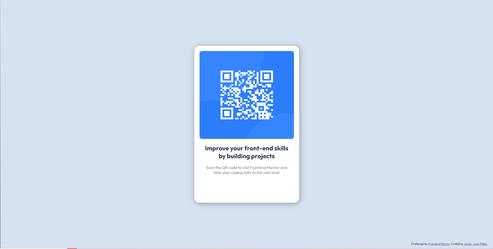

# Frontend Mentor - QR code component solution

This is a solution to the [QR code component challenge on Frontend Mentor](https://www.frontendmentor.io/challenges/qr-code-component-iux_sIO_H). Frontend Mentor challenges help you improve your coding skills by building realistic projects. 

## Table of contents

  - [Screenshot](#screenshot)
  - [Built with](#built-with)
  - [Useful resources](#useful-resources)
  - [Author](#author)

### Screenshot

### Built with

- HTML
- CSS
- Flexbox
- Mobile-first workflow

### Useful resources

- [Example resource 1](https://imagecolorpicker.com) - Color picker.

## Author

- Twitter ->  [@xavito014]

